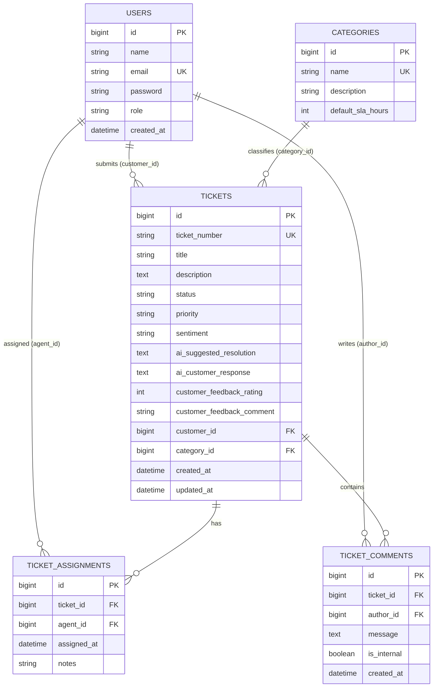

# Database ER Diagram

```mermaid
erDiagram
    USERS ||--o{ TICKETS : "submits (customer_id)"
    USERS ||--o{ TICKET_ASSIGNMENTS : "assigned (agent_id)"
    USERS ||--o{ TICKET_COMMENTS : "writes (author_id)"
    CATEGORIES ||--o{ TICKETS : "classifies (category_id)"
    TICKETS ||--o{ TICKET_ASSIGNMENTS : "has"
    TICKETS ||--o{ TICKET_COMMENTS : "contains"

    USERS {
        bigint id PK
        string name
        string email UK
        string password
        string role
        datetime created_at
    }

    CATEGORIES {
        bigint id PK
        string name UK
        string description
        int default_sla_hours
    }

    TICKETS {
        bigint id PK
        string ticket_number UK
        string title
        text description
        string status
        string priority
        string sentiment
        text ai_suggested_resolution
        text ai_customer_response
        int customer_feedback_rating
        string customer_feedback_comment
        bigint customer_id FK
        bigint category_id FK
        datetime created_at
        datetime updated_at
    }

    TICKET_ASSIGNMENTS {
        bigint id PK
        bigint ticket_id FK
        bigint agent_id FK
        datetime assigned_at
        string notes
    }

    TICKET_COMMENTS {
        bigint id PK
        bigint ticket_id FK
        bigint author_id FK
        text message
        boolean is_internal
        datetime created_at
    }
```
